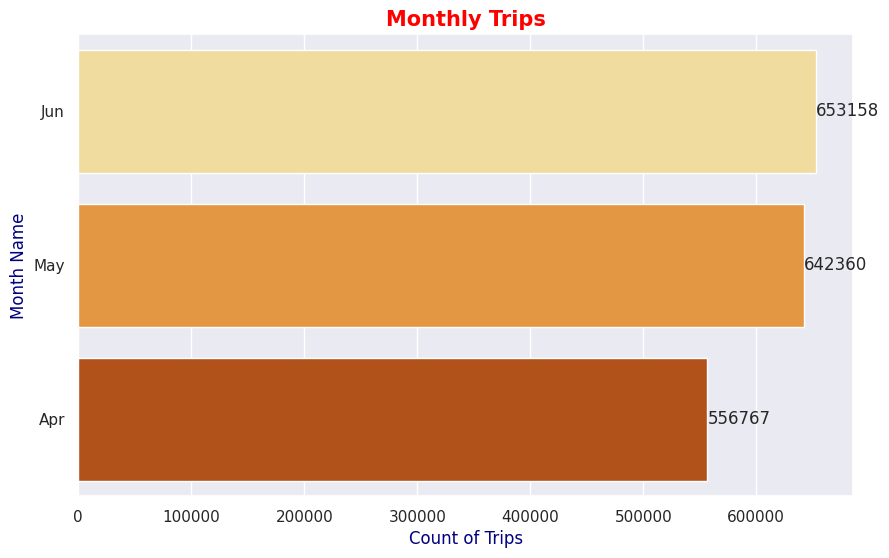
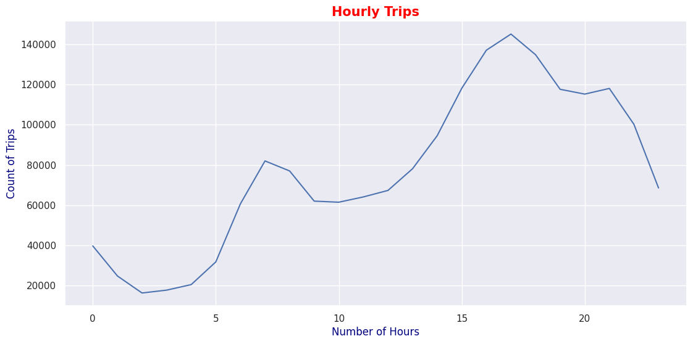
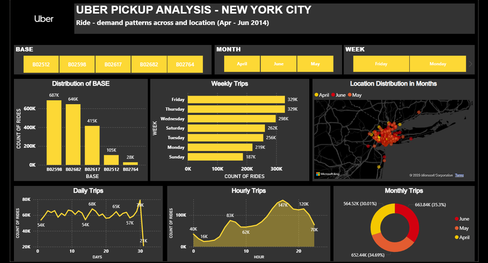

# 🚕 Uber Pickup Analysis — New York City 

## 🧩 Project Overview

This end-to-end project focuses on analyzing Uber pickup data from New York City (April–June 2014).
The objective was to uncover ride-demand trends across time and location to improve driver deployment and operational efficiency.

- Python was used for Exploratory Data Analysis (EDA) to identify daily, weekly, and monthly pickup patterns.
- Excel was utilized for data cleaning and date-time formatting.
- Power BI was used to design an interactive dashboard visualizing key insights such as base distribution, peak hours, and pickup zones.

This analysis helps understand passenger demand behavior, optimize driver allocation, and support data-driven decision-making

---

## 🧠 Objectives

- Analyze daily, weekly, and monthly ride-demand patterns to understand temporal trends.
- Identify the most active dispatching bases contributing to overall trip volume.
- Examine hourly pickup activity to determine peak demand hours.
- Visualize geographical distribution of pickups using latitude and longitude to locate high-demand zones.
- Provide actionable insights to help optimize driver allocation and enhance operational efficiency.

---
## 📂 Project Structure

| File / Folder | Description |
|----------------|--------------|
| `Uber_EDA_Analysis.ipynb` | Main Jupyter notebook with code & analysis |
| `UBER_DASHBOARD.pbix` | Dashboard |
| Dashboard.png | Dashboard view in image |
| `images/` | Visualization charts from the analysis  & Dashaboard | 
| `Uber_EDA_Report.pdf` | Final analysis report |
| `README.md` | Project overview & summary | 

## 🧰 Tools & Technologies
- **Jupyter Notebook**
- **Python Libraries:** Pandas, NumPy, Matplotlib, Seaborn
- **Power BI**
- **Excel**

---

### 📦 Dataset Source
The Uber pickup data (April–June 2014) is available on Kaggle:  
👉 [Uber Pickups in New York City — Kaggle Dataset](https://www.kaggle.com/datasets/fivethirtyeight/uber-pickups-in-new-york-city)

## 📊 Key Insights
- **Base B02598** recorded the highest number of pickups.  
- Ride demand peaks on **Thursdays and Fridays**.  
- **June** had the highest overall trip volume.  
- Rides increase after **5 AM**, peak between **5 PM–7 PM**, and drop after **9 PM**.  
- Pickups are concentrated in **central New York City zones**.

---

## 📊 Visual Insights

### 🚕Top Bases

### 📈 Monthly Trends

### ⏰Hourly Trends

### 📍 Location Distribution 

---

## 📊 Dashboard View

This Power BI dashboard visualizes Uber pickup trends across New York City from April to June 2014.
It highlights time-based and location-based patterns derived from the Python EDA phase to support data-driven decision-making.

Key visuals include:

- Base Distribution: Identifies the most active dispatch bases.
- Monthly, Weekly, and Daily Trends: Shows fluctuations in ride demand over time.
- Hourly Analysis: Reveals peak pickup hours.
- Geographical Map: Displays pickup concentration across different city zones using latitude and longitude.

Below is the final Power BI dashboard view:

### Dashboard 

-
---

## 👨‍💻 Author
**Ravi Kumar Gupta**  
📍 Delhi, India  

---

⭐ *An Exploratory Data Analysis (EDA) project on Uber pickups — uncovering ride-demand patterns across New York City using Python and Jupyter Notebook.*

---
